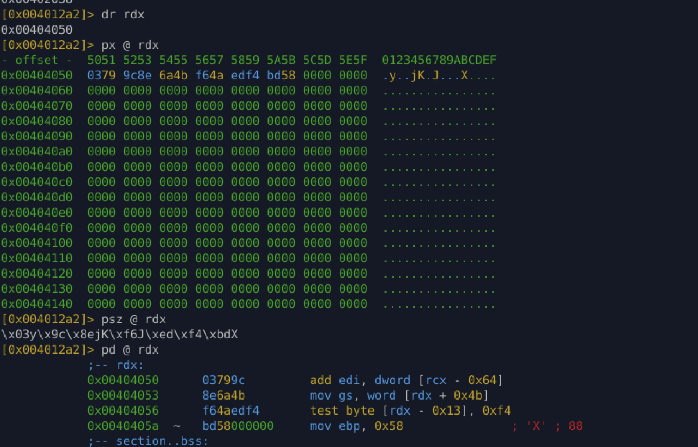

# Lab 04-4 — Payload Discovery & Runtime Analysis

## Objective

Identify and validate the **real payload buffer** in a staged, self-decrypting binary and confirm its runtime behavior.

---

## Key Breakthrough

We confirmed the **payload location at runtime** by inspecting register state at the `printf` call.

### ABI Confirmation (x86_64 SysV)

At the `printf("[+] Payload unlocked: %s", payload)` call:

* **RDI** → format string (may be clobbered later)
* **RSI** → format string address
* **RDX** → **payload pointer**

Observed registers:

* `RSI = 0x00402038` → `"[+] Payload unlocked: %s"`
* `RDX = 0x00404050` → **payload buffer**

This perfectly matches the calling convention.

---

## Payload Dump

### Raw bytes at `0x00404050`

```
03 79 9c 8e 6a 4b f6 4a ed f4 bd 58
```

### String view (`psz`)

```
\x03y\x9c\x8ejK\xf6J\xed\xf4\xbdX
```

**Conclusion:** This is **binary data**, not a string. Expected for encrypted or staged payloads.

---

## Why Disassembly Looked Wrong

Running `pd @ rdx` produced garbage instructions.

This is **expected** because:

* The buffer is **data**, not yet executed
* Or it is **stage-1 output**, not final shellcode
* Or execution has not yet transferred to this region

**Rule:** Disassembly only makes sense **after RIP jumps to the buffer**.

---

## Behavioral Indicators

* `mprotect` used earlier → memory made executable
* Small, non-ASCII payload → decoder stub or shellcode
* Printed via `%s` → analyst bait / decoy

Strong indicators of **staged shellcode loader behavior**.

---


## Final Takeaway

This lab confirms:

* Correct ABI reasoning
* Accurate runtime payload identification
* Understanding of staged decryption behavior

