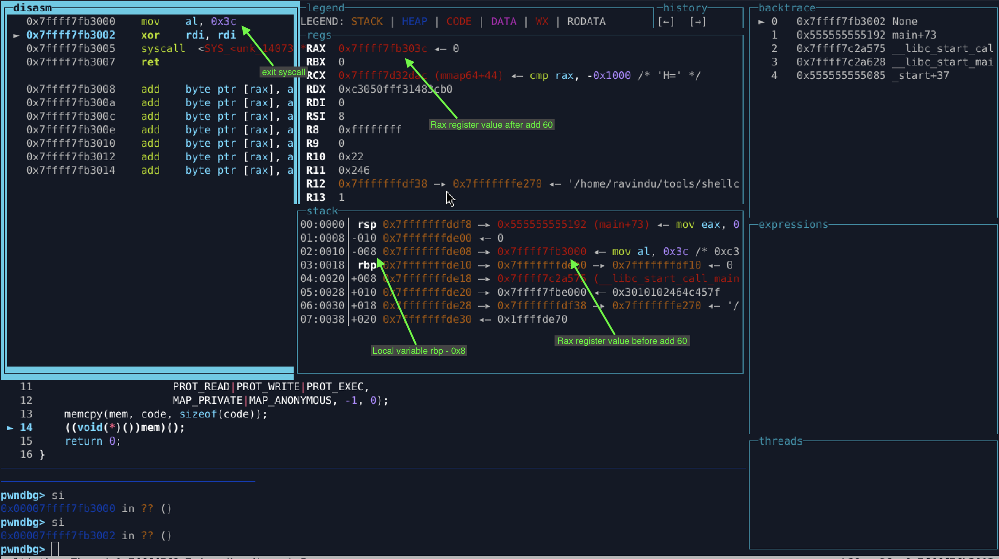

# **Exit Shellcode (x86_64 Linux) — V2 (Short, Context‑Dependent)**

A **shortened** 64‑bit Linux exit shellcode optimized for size. This version intentionally removes full `rax` zeroing to reduce bytes and demonstrates a **context‑dependency pitfall** that is fixed in V3.

---

## **Overview**

This shellcode terminates the process via:

* **Syscall:** `exit(0)`
* **rax = 60** (`sys_exit`, **lower 8 bits only**)
* **rdi = 0**  (exit status)

**Design goals (V2):**

* Smaller footprint than V1
* No NULL bytes
* Position‑independent (PIC)

⚠️ **Important:** V2 is **context‑dependent** and not safe for generic injected shellcode. See **Bug & Limitation** below.

---

## **Shellcode Length**

* **7 bytes** (no `ret`)

---

## **Raw Bytes**

```
b0 3c 48 31 ff 0f 05
```

---

## **Instruction Breakdown**

| Bytes    | Instruction  | Meaning                                     |
| -------- | ------------ | ------------------------------------------- |
| b0 3c    | mov al, 0x3c | Set **lower 8 bits** of `rax` to syscall 60 |
| 48 31 ff | xor rdi, rdi | Clear `rdi` (exit status = 0)               |
| 0f 05    | syscall      | Invoke system call                          |

---

## **Why This Works (Sometimes)**

* In many ELF `_start` contexts, `rax` happens to be **0**.
* Writing only `al` results in `rax == 0x3c`, so `sys_exit` executes correctly.

This makes V2 valid for **standalone ELF demos** and controlled loaders.

---

## **Bug / Limitation (Critical)**

`mov al, 0x3c` **does not clear the upper 56 bits of `rax`**.

If `rax` is non‑zero before execution (common in exploit / ROP contexts):

* `rax` becomes `0x??_??_??_??_??_??_??_3c`
* Kernel interprets an **invalid syscall number**
* Result: `ENOSYS` or undefined behavior

👉 **Conclusion:** V2 is **not safe** for injected shellcode or unknown register states.


---

## **When to Use V2**

✔ Educational demonstrations
✔ Size‑optimization comparison
✔ Controlled ELF `_start` execution

❌ Real exploit payloads
❌ ROP chains / injected shellcode

---

## **Build Instructions**

```
make build
```

---

## **Disassembly**

```
objdump -M intel -d exit_v2.o
```


---

## **Verification Notes**

* Verify `rax` state before execution if testing outside `_start`.
* Use GDB to inspect `rax` upper bits prior to `syscall`.

---

## **Next Version**

**V3** fixes this bug by **fully controlling `rax`** while keeping the same size:

```
push 60
pop rax
xor edi, edi
syscall
```

V3 is **exploit‑grade**, context‑safe, and null‑free.

---

## **Summary**

V2 demonstrates how aggressive size optimization can introduce **subtle correctness bugs** at the register level. This version exists to document the trade‑off and motivate the safer V3 design.
