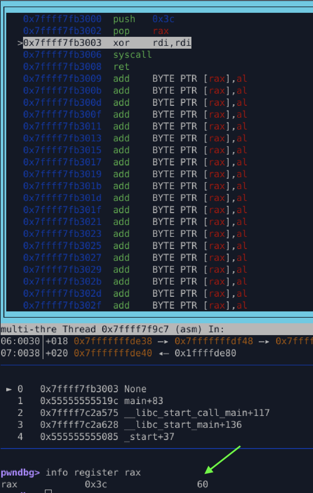

# **Exit Shellcode (x86_64 Linux) – V3 (Exploit‑Grade)**

A corrected, exploit‑grade version of the exit shellcode that **fixes the V2 bug** while keeping the payload **null‑free, position‑independent, and byte‑minimal**.

V3 is the version we actually want to use in real shellcode execution contexts.

---

## **Why V3 Exists (What Was Wrong in V2)**

In **V2**, the syscall number was loaded using:

```
mov al, 60
```

This only overwrites the **low 8 bits** of `RAX`. If `RAX` previously contained garbage (very common in exploits), the syscall number becomes **invalid**, leading to:

* `SIGSEGV`
* `ENOSYS`
* silent failure

This bug does **not** appear in clean ELF execution, which is why V2 *seems* to work — but fails in injected shellcode.

**V3 fixes this properly.**

---

## **Core Fix (Exploit‑Grade Pattern)**

Load syscall number using stack‑based technique.

```
push 60
pop rax
```

Key detail:

* push / pop guarantees full RAX = 60
* No dependency on previous register state
* No NULL bytes
* Smaller than V1 and safer than V2

This makes the shellcode **deterministic in hostile environments**.



---

## **Shellcode Length**

* **7 bytes** (no `ret`)
* **8 bytes** (with optional `ret`)

Smaller **and** safer than V2.

---

## **Raw Bytes (Null‑Free)**

```
6A 3C 58 31 FF 0F 05 C3
```

✔ No NULL bytes
✔ Position‑Independent
✔ Exploit‑grade register state

---

## **Instruction Breakdown**

| Bytes | Instruction  | Purpose                       |
| ----- | ------------ | ----------------------------- |
| 6A 3C | push 60.     | push to the stack |
| 58    | pop rax      | Load `sys_exit` using stack (rsp->rax)              |
| 31 FF | xor edi, edi | Exit status = 0               |
| 0F 05 | syscall      | Enter kernel                  |

---


## **Why This Is the Correct Exploit Version**

V3 guarantees:

* No reliance on previous register state
* Correct syscall number **every time**
* Safe execution when injected via:

  * buffer overflow
  * ROP chain
  * JIT spray
  * mmap’d shellcode


---

## **Comparison Summary**

| Version | Bytes | Safe in Exploits | Notes             |
| ------- | ----- | ---------------- | ----------------- |
| V1      | 10    | ✅                | Clear but larger  |
| V2      | 7     | ❌                | Broken if RAX ≠ 0 |
| **V3**  | **7** | **✅**            | Optimal + safe    |

---

