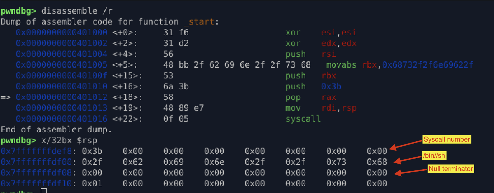
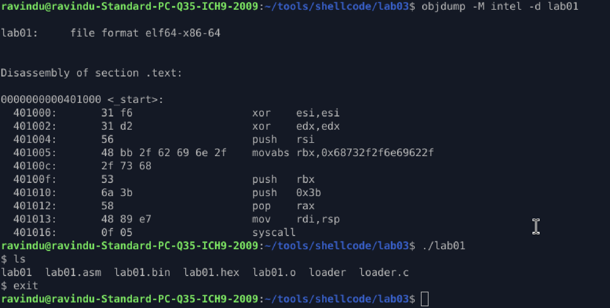

## Lab 03.1 – Stack-Based String Construction (Notes)

## What This Lab Demonstrates

This lab shows how to construct required runtime data **entirely on the stack**, without relying on:

* `.data` / `.rodata`
* absolute addresses
* libc helpers

The string `/bin//sh` is built dynamically and referenced directly via `rsp`, making the shellcode **position‑independent** and compatible with ASLR-enabled environments.

---

## Key Techniques Used

#### 1. Stack-Only Data Construction

```asm
push rsi
push rbx
```

* The stack is used as both **data storage** and **argument source**
* No static memory sections are required
* This mirrors real exploit constraints where writable memory is limited

---

#### 2. Little-Endian Awareness

```asm
mov rbx, 0x68732f2f6e69622f
```

* Immediate value is written in reverse byte order
* When pushed, memory correctly contains:

  ```
  2f 62 69 6e 2f 2f 73 68
  "/bin//sh"
  ```

Incorrect endianness would result in an invalid path and failed syscall.

---

#### 3. Intentional Double Slash (`//`)

* `/bin//sh` is functionally identical to `/bin/sh`
* Enables clean 8-byte alignment
* Avoids partial pushes and unnecessary instructions
* Common professional shellcoding pattern

---

#### 4. Clean Null-Termination

```asm
push rsi
```

* Zeroed register is reused to terminate the string
* Avoids embedding null bytes inside instructions
* Memory nulls are safe; instruction nulls often are not

---

#### 5. ABI-Correct Register Usage

```asm
mov rdi, rsp
xor esi, esi
xor edx, edx
```

* `rdi` → filename pointer
* `rsi` → argv = NULL
* `rdx` → envp = NULL
* Fully compliant with Linux x86‑64 `execve` syscall ABI

---

## Why This Works Under ASLR

* No absolute addresses
* No RIP-relative static data
* All references are stack-relative at runtime
* Shellcode remains relocatable regardless of load address

---

### ⚠️ Design Tradeoff (Important Insight)

This implementation uses:

```asm
movabs rbx, imm64
```

**Pros**

* Extremely compact
* Very readable
* No null bytes in this specific immediate

**Cons**

* `movabs` increases shellcode size
* Some exploit contexts forbid 64-bit immediates

In later labs, this will be replaced with:

* split pushes
* arithmetic construction
* encoded payloads

This lab intentionally favors **clarity over evasion**.

---

## Verification Result

Successful interactive shell confirms:

* Correct stack layout
* Valid syscall arguments
* No alignment or memory faults

---



