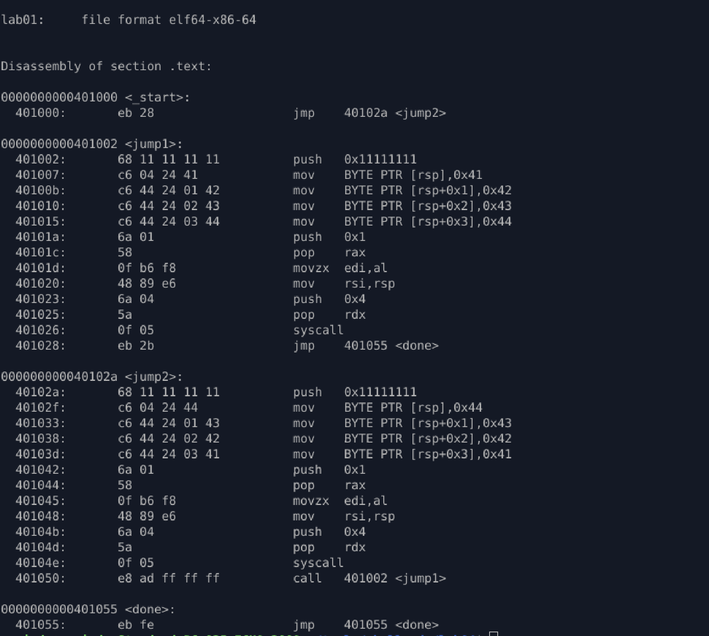

# lab_01_RIP_Relative_Addressing

## Purpose

Learn how shellcode **moves reliably in memory** without knowing its absolute address.
This lab focuses on **RIP-relative control flow**, which is the foundation of all real shellcode.

---

## Core Idea

Shellcode:

* Does **not** know where it is loaded
* Cannot rely on fixed addresses
* Must survive **ASLR**

Solution: **relative jumps and calls**

All control flow is based on **offsets from RIP**, not absolute memory locations.

---

## What this lab demonstrates

* Forward jumps (`jmp`)
* Backward execution (`call`)
* Controlled execution paths
* Stack-based runtime data construction
* No hardcoded addresses
* Position-independent execution

---

## Control Flow Overview

```
_start
  |
  └── jmp ──► jump2
               |
               └── call ──► jump1
                                |
                                └── jmp ──► done (infinite loop)
```

This proves shellcode can:

* Jump forward
* Jump backward
* Re-enter earlier code
* Loop safely

All without absolute addresses.

---

## Key Techniques Used

### RIP-relative execution

```asm
jmp short jump2
call jump1
```

Disassembly shows addresses, but machine code uses **relative offsets**:

```
e8 ad ff ff ff   ; call with negative offset
```

ASLR-safe.

---

### Runtime data construction (no static strings)

```asm
push 0x11111111
mov byte [rsp], 0x41
mov byte [rsp+1], 0x42
mov byte [rsp+2], 0x43
mov byte [rsp+3], 0x44
```

* No ASCII immediates in instruction stream
* Stack used as temporary buffer
* Prepares for polymorphic shellcode

---

### Shellcode-style syscalls

```asm
push 0x1
pop rax          ; syscall: write
movzx edi, al    ; fd = 1
mov rsi, rsp     ; buffer
push 0x4
pop rdx          ; length
syscall
```

* Minimal instructions
* No `mov imm64`
* Register reuse

---

## Skills Gained

* Understanding RIP-relative control flow
* Writing ASLR-safe shellcode
* Building execution paths without labels or addresses
* Using the stack as controlled memory
* Thinking in **flow**, not addresses

---

## Why this matters

This lab is a **mandatory prerequisite** for:

* Call-pop self-location
* Position-independent data access
* Egg hunters
* Staged payloads
* Polymorphic shellcode

If shellcode cannot move reliably, **nothing else works**.

---

## Outcome

A fully position-independent shellcode sample that:

* Executes correctly at any memory address
* Uses only relative control flow
* Constructs data dynamically at runtime
* Never relies on absolute memory locations

---

