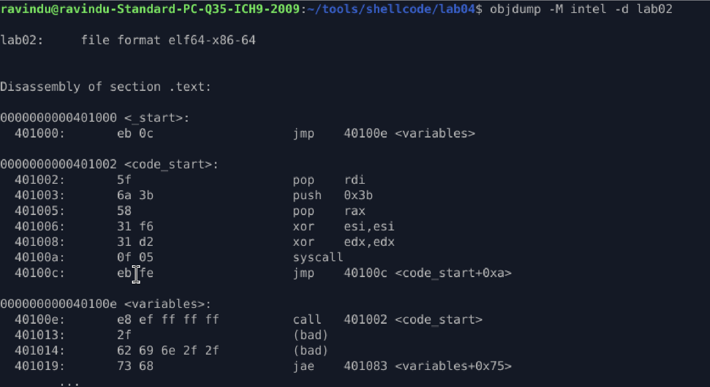

# lab 02 Call Pop Self_Location

## Purpose

Learn shellcode how to **discover its own location in memory** at runtime.
This lab introduces the **call-pop primitive**, a foundational technique for position-independent shellcode.

---

## Core Problem

Shellcode:

* Has no symbols or labels at runtime
* Cannot use absolute addresses
* Must survive ASLR
* Still needs to reference its own data

**Solution:** Use `call` to push RIP onto the stack, then `pop` it into a register.

---

## Core Technique: CALL → POP

### How it works

```asm
call target
; RIP of next instruction is pushed onto the stack
```

Immediately after:

```asm
pop rdi
; rdi now contains RIP
```

This allows shellcode to:

* Know where it is loaded
* Access embedded data safely
* Remain fully position-independent

---

## Control Flow Overview

```
_start
  |
  └── jmp ──► variables
                |
                └── call ──► code_start
                                |
                                └── pop rdi  → "/bin//sh"
```

The `call` instruction pushes the address of the embedded data onto the stack, which is then retrieved using `pop`.

---

## What this lab demonstrates

* Retrieving RIP at runtime
* Using RIP as a base pointer
* Embedding raw data inside shellcode
* Executing code without hardcoded addresses
* Real-world execve shellcode structure

---

## Embedded Data Technique

```asm
call code_start
db "/bin//sh", 0
```

* Data is placed directly after the `call`
* RIP points exactly to the start of the string
* Disassemblers mark it as `(bad)` because it is **data, not code**
* This is expected and correct behavior

---

## Disassembly Insight

Objdump shows:

```asm
e8 ef ff ff ff   call code_start
```

Even though objdump displays absolute addresses, the machine code uses **relative offsets**, making the shellcode ASLR-safe.

---

## Syscall Logic (Linux x64)

The retrieved RIP is used directly as the argument to `execve`:

* `rax = 59` → execve syscall
* `rdi = "/bin//sh"` → filename
* `rsi = 0` → argv
* `rdx = 0` → envp

This results in a clean, position-independent shell spawn.

---

## Skills Gained

* RIP discovery via call-pop
* Self-locating shellcode
* Embedded data access
* Position-independent execution
* Foundation for egg hunters and staged payloads

---

## Why this matters

This primitive is required for:

* Egg hunters
* Shellcode decoders
* Staged payload loaders
* Polymorphic shellcode
* Real-world exploit payloads

Without self-location, advanced shellcode is impossible.

---

## Outcome

A fully position-independent shellcode sample that:

* Discovers its own memory location
* Accesses embedded data safely
* Executes without absolute addresses
* Works correctly under ASLR

---

