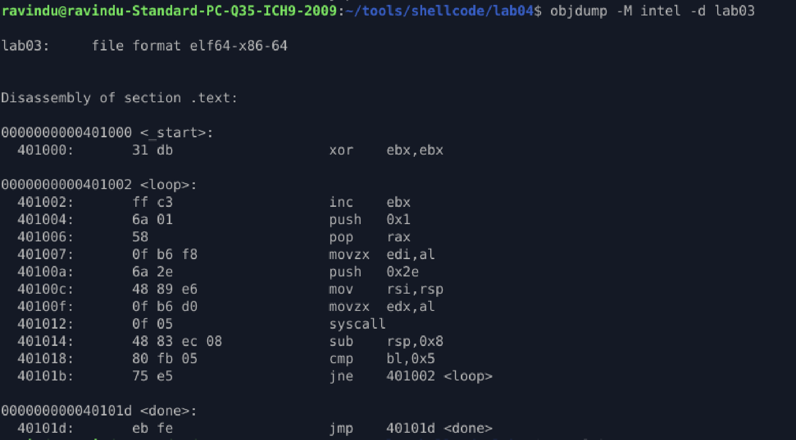

# lab 03 Jump Logic and Loops

##  Purpose

Learn shellcode how to implement **controlled looping and conditional execution** using only jumps and comparisons.
This lab builds the **execution logic backbone** required for egg hunters, memory scanners, and staged payloads.

---

## Core Problem

Shellcode must often:

* Repeat actions
* Scan memory
* Retry operations
* Loop indefinitely until success

But it has:

* No high-level constructs (`for`, `while`)
* No function calls
* No safe exit paths

Solution: **manual loop construction using jumps and conditionals**

---

## Core Concepts

* Forward and backward jumps
* Conditional execution (`cmp`, `jne`)
* Counter-based loops
* Infinite controlled execution
* Stack discipline during repeated syscalls

---

## Control Flow Overview

```
_start
  |
  └── init counter
        |
        └── loop:
              ├── increment counter
              ├── perform syscall
              ├── clean stack
              ├── compare counter
              └── jump back if not done
  |
  └── done → infinite loop
```

This is the **skeleton used by egg hunters**.

---

## Loop Implementation

```asm
loop:
    inc ebx
    ...
    cmp bl, 5
    jne loop
```

* Loop controlled entirely by jumps
* No absolute addresses
* Execution flow is fully position-independent

---

## ⚠️ Critical Syscall Insight (Very Important)

On **x86-64 Linux**, the `syscall` instruction **clobbers**:

* `rcx`
* `r11`

This means:

* `rcx` **cannot be used** as a reliable loop counter after a syscall
* Using `rcx` causes silent logic bugs

Safe registers for loop counters:

* `rbx`
* `rdi`
* memory-based counters

This lab intentionally avoids `rcx` to demonstrate correct practice.

---

## Stack Discipline

The stack is used as a temporary buffer during each iteration:

```asm
push 0x2e
mov rsi, rsp
...
add rsp, 8
```

* Stack space is reclaimed every loop
* Prevents stack growth
* Ensures long-running shellcode stability

---

## Skills Gained

* Manual loop construction with jumps
* Conditional execution using flags
* Understanding syscall side-effects
* Register preservation discipline
* Building scan-style execution logic

---

## Why this lab matters

This logic is directly used in:

* Egg hunters
* Memory scanners
* Decoder stubs
* Retry-based payload loaders
* Persistent shellcode loops

Without solid loop control, advanced shellcode **fails silently**.

---

## Outcome

A position-independent shellcode sample that:

* Loops a fixed number of times
* Uses only relative jumps
* Survives syscall side-effects
* Maintains stack integrity
* Demonstrates real exploit-dev control flow

---


