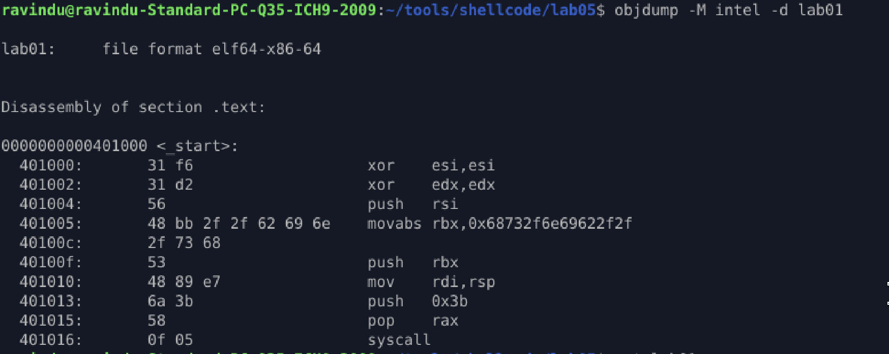

# Lab_01 — Minimal `execve("/bin/sh")`

## Purpose

Spawn `/bin/sh` **cleanly** using only a syscall. No libc, no globals, stack-only string construction.

---

### Techniques Used

1. **Syscall setup (x86-64 Linux ABI)**

   | Register | Purpose                            |
   | -------- | ---------------------------------- |
   | `rax`    | syscall number (`59` for `execve`) |
   | `rdi`    | pointer to filename (`/bin/sh`)    |
   | `rsi`    | argv (NULL)                        |
   | `rdx`    | envp (NULL)                        |

2. **Stack-only string construction**

   * Push `/bin//sh` as a 64-bit immediate using `mov rbx, 0x68732f6e69622f2f`
   * Push a null terminator with `push rsi`

3. **Register reuse**

   * `esi` cleared with `xor esi, esi` → reused for NULL termination

4. **Syscall execution**

   * `push 59; pop rax`
   * `syscall`

---

## Key Observations

* Stack layout points `rsp → "/bin//sh\0"`
* Registers before syscall:

  * `rax = 59`
  * `rdi = rsp`
  * `rsi = 0`
  * `rdx = 0`
* Minimal, correctness-first shellcode primitive
* Works reliably as a reference primitive for future payloads

---

## Notes on Minimal vs Optimized

* **Minimal:** Only essential instructions, correct syscall setup
* **Not optimized:** Contains visible string `/bin//sh`, uses `rbx` register, not polymorphic

---

## Mindset Takeaway

> This lab proves syscall-level control. Every future shellcode — reverse shells, bind shells, egg hunters — will build on this **execve spine**.

---

