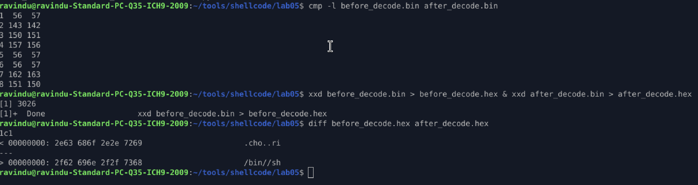

# Lab 02 — XOR decoded stack string (manual)

## What I wanted to do

Hide `/bin//sh` from the shellcode bytes and reconstruct it only at runtime.
Goal was simple: static analysis should not see the string, but the kernel should.

---

### How I did it (high level)

* Took `/bin//sh` and manually XOR-encoded it with key `0x01`
* Pushed the encoded 8-byte value onto the stack
* XOR-decoded it **in place** on the stack using `0x0101010101010101`
* Passed the decoded stack pointer directly to `execve`

Important part: decoding happens **after** the push, not in registers.

---

### Bug I hit (important lesson)

At first, I XORed with `0x1`.

That only flips **one byte**, not the whole qword.
Result was half-decoded garbage like:

```
/cho..ri
```

Fix was obvious after debugging:

* XOR key must match **data width**
* For 8 bytes → key must be `0x0101010101010101`

Once I fixed that, decoding worked perfectly.

---

### Verification (before vs after decode)

I dumped the stack bytes before and after XOR and compared them.

```bash
cmp -l before_decode.bin after_decode.bin
```

Output:

```
1  56  57
2 143 142
3 150 151
4 157 156
5  56  57
6  56  57
7 162 163
8 151 150
```

Hex diff:

```bash
diff before_decode.hex after_decode.hex
```

```
00000000: 2e63 686f 2e2e 7269   .cho..ri
00000000: 2f62 696e 2f2f 7368   /bin//sh
```

So:

* Shellcode bytes → **encoded**
* Runtime stack memory → **real `/bin//sh`**

Exactly what this lab was meant to prove.

---


