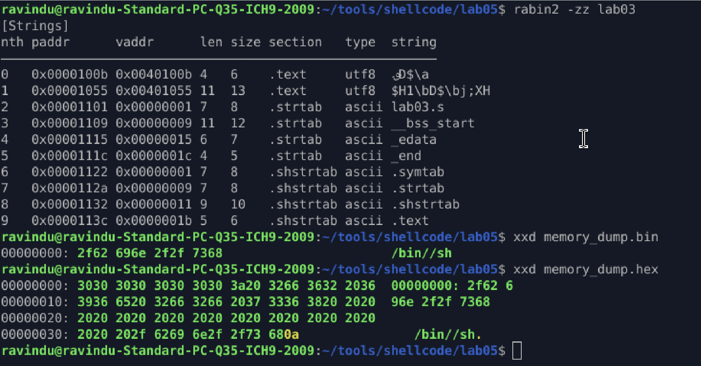

# Lab 03 — Arithmetic String Construction (`/bin//sh`)

At first this lab felt annoying because I *know* how easy it is to just push `/bin//sh`.
But the whole point here was **not doing the easy thing**.

The goal was simple but strict:

* no static `/bin`
* no encoded blobs
* no obvious decoding loop

So I decided to **build the string byte-by-byte using only arithmetic instructions**.

Every character of `/bin//sh` is created at runtime using stuff like:

* `add`, `sub`
* `imul`, `idiv`
* `neg`, `dec`

Nothing readable exists in the binary itself.

To double-check that, I ran:

```bash
rabin2 -zz lab03
```

and yeah — no `/bin`, no `sh`, nothing useful shows up.
Static analysis sees garbage.

Then I dumped memory at runtime and checked it with `xxd`, and **only then** the string appears:

```
/bin//sh
```

So this confirms the idea:

> static view = meaningless
> runtime view = real intent

This method is noisy and definitely not small shellcode, but that’s fine.
This lab isn’t about size — it’s about **control and evasion**.

What this lab really taught me is how to *think under constraints*.
When you can’t push strings, can’t XOR blobs, and can’t rely on clean constants, you’re forced to actually **build behavior**, not just bytes.

This is the kind of thing that makes reverse engineers and scanners unhappy — which is exactly the point 

---

