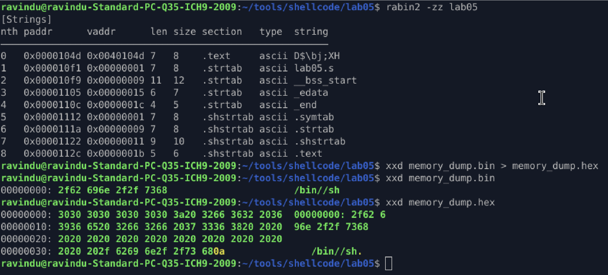

# Lab 05 — Partial Construction + Rotation

**Goal**
Construct `/bin//sh` without embedding readable strings by partially building bytes and transforming them using bitwise operations.

**Approach**

* Reserve stack space manually
* Construct each byte independently
* Use `shr`, `shl`, `rol`, `ror` to transform non-obvious constants into target characters
* Write bytes directly into stack memory
* Avoid pushing full strings or qwords

**Implementation Details**

* Stack space allocated using `sub rsp, 8`
* Each character is derived from an unrelated immediate value
* Transformations applied before storing:

  * `/` generated via `shr`
  * `b` via `rol`
  * `i` via `ror`
  * `n` via `shl`
* Null byte written explicitly
* `execve("/bin//sh", NULL, NULL)` invoked using syscall `59`

**Verification**

* Static string scan using `rabin2 -zz` shows no `/bin` or `sh`
* Runtime memory dump confirms correct construction:

  ```
  /bin//sh
  ```
* Confirms string exists only at execution time

**Result**

* No readable strings in `.text`
* Final string appears only in memory
* Technique suitable for polymorphic or evasive shellcode patterns

**Notes**

* Focus is on construction logic, not size optimization
* Technique can be combined with arithmetic or register-only construction in later labs

---


