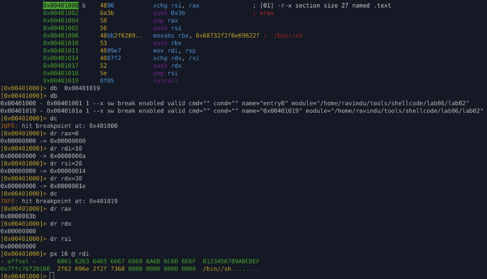

# Lab 06.2 — Partial Zero Knowledge execve

### Goal

Create `execve("/bin//sh", 0, 0)` when **only one thing is known at entry**.

Assumption for this lab:

* `rax = 0`
* every other register is garbage
* stack is writable but contents are unknown

No blind zeroing allowed.

---

### Key idea

Treat the known zero (`rax`) as a **resource**, not a value.

Once one register is proven zero, recycle it carefully and **preserve it until syscall time**.

---

### Zero derivation strategy

1. **First zero**

   ```asm
   xchg rsi, rax
   ```

   `rax` is known zero → move it into `rsi`.

2. **Preserve zero**

   * Do not destroy `rsi` before syscall
   * If it must be reused, restore it explicitly

---

### Syscall setup

```asm
push 59
pop rax
```

`rax = 59` without `mov`.

---

### Argument construction

```asm
push rsi                    ; NULL terminator
mov rbx, 0x68732f2f6e69622f  ; /bin//sh
push rbx
mov rdi, rsp
```

* Stack now contains `/bin//sh\0`
* `rdi` points to valid filename

---

### envp and argv handling

```asm
xchg rdx, rsi   ; rdx = 0 (envp), rsi becomes garbage
push rdx
pop rsi         ; restore rsi = 0 (argv)
```

Important detail:

* Zero is **temporarily consumed**
* Then explicitly restored before syscall

This avoids the mistake of passing garbage `argv`.

---

### Final state before syscall

```
rax = 59
rdi = pointer to "/bin//sh"
rsi = 0
rdx = 0
```

ABI correct.

---

### What was avoided

* No `xor reg, reg`
* No `mov reg, 0`
* No assumptions about register state
* No reliance on luck or environment

Every zero used is explainable.

---

### Verification

* Registers dirtied before execution
* Stack inspected at runtime
* Register values checked at syscall boundary
* Shell spawned successfully

---

### Takeaway

This lab is about **zero lifetime**.

Getting a zero is easy.
Keeping it alive until the syscall is the real challenge.

---


