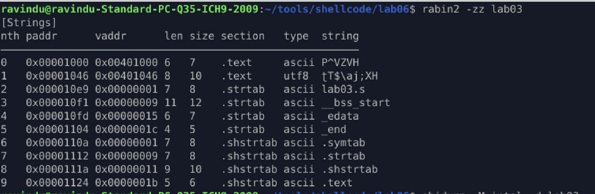

# Lab 06 — Register Recycling without Immediates

## Objective

Execute `execve("/bin//sh", NULL, NULL)` under the following constraints:

* No string immediates
* No `/bin//sh` literals
* No `push "/bin//sh"`
* No imm64 data blobs
* Minimal registers
* Maximum reuse

---

## Core Concept

This lab focuses on **register recycling** and **constraint-driven construction**.

Instead of allocating new registers or decoding encoded buffers:

* a single zeroed register is recycled
* the stack is used as writable memory
* bytes are synthesized using arithmetic only

This models **real exploit conditions** where immediates and encoders are blocked.

---

##  Register Recycling Strategy

| Register | Purpose                      |
| -------- | ---------------------------- |
| `rax`    | zero source + syscall number |
| `rsi`    | argv = NULL                  |
| `rdx`    | envp = NULL                  |
| `dl`     | byte construction scratch    |
| `rsp`    | writable string buffer       |

No register is wasted.

---

##  Stack String Construction

* Reserve space: `sub rsp, 8`
* Write each byte individually
* Use only:

  * `add`
  * `sub`
  * `inc`
  * `dec`

No byte is written as its final ASCII value.

---

## Stealth Properties

* No readable `/bin/sh` in `.text`
* No decode loops
* No static XOR keys
* Linear execution flow
* Survives basic string scanning (`rabin2 -zz`)

---

## Key Takeaway

> When immediates are forbidden, **control beats cleverness**.
> Register recycling + arithmetic synthesis is often enough.

---

