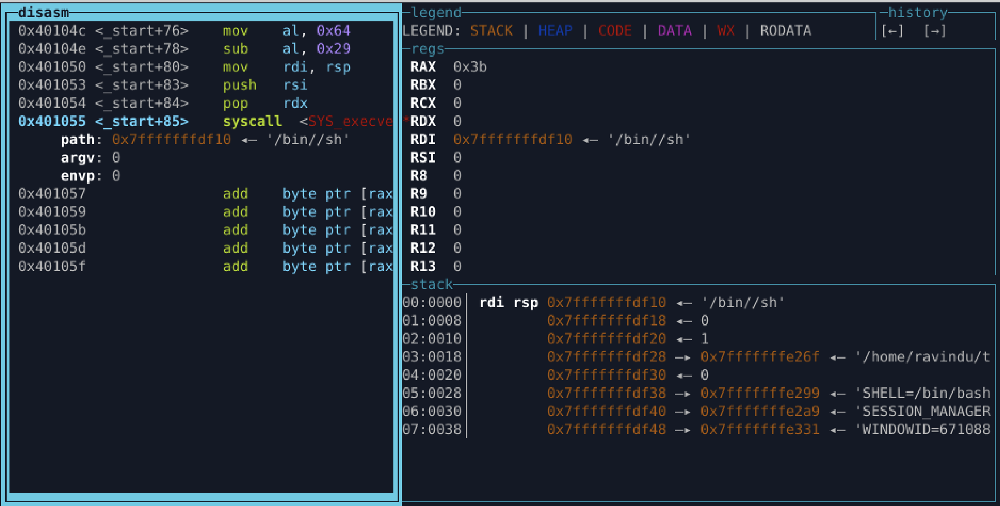

# Lab 06.4 — Syscall Number Recycling

**Objective**
Invoke `execve("/bin//sh", 0, 0)` without directly loading the syscall number.

---

**Initial assumptions**

* All registers contain garbage
* `rax` is a positive value
* No registers are initially zeroed
* Stack is writable

---

**Key constraint**

* Direct syscall immediates forbidden
  (`mov rax, 59`, `push 59` not allowed)

---

**Zero derivation**

* Used `cdq` to derive `rdx = 0`
* Recycled zero through `push/pop` into `rsi`

---

**String construction**

* Reserved stack space manually (`sub rsp, 8`)
* Built `/bin//sh` byte-by-byte
* Avoided partial pushes to prevent padding/null artifacts

---

**Syscall derivation**

* Recycled zero into `rax`
* Constructed syscall number using arithmetic:

  * `100 - 41 = 59`
* No direct syscall constants used

---

**Why this matters**

* In real exploits, syscall numbers are often filtered or signatured
* Values must be *derived*, not assigned
* Teaches transformation-based thinking

---

**Verification**

* `objdump`: no direct syscall immediates
* `rabin2 -zz`: no `/bin//sh` string present
* Runtime test: shell spawned successfully

---

