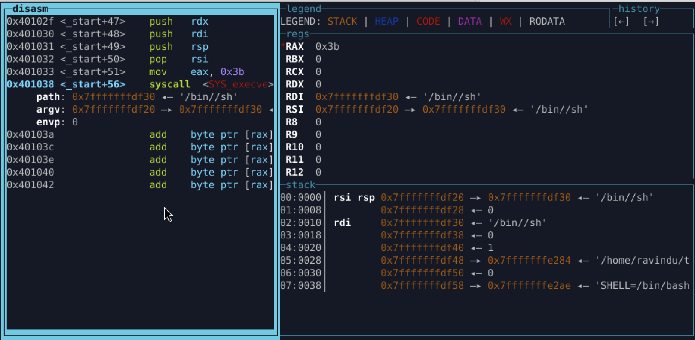

## Lab 06.5 — Argument Pointer Recycling

**Focus:**
Derive `execve` arguments using **only stack + recycled registers**
No direct pointer moves, no free zeros.

---

### Key Rule

`execve` needs:

```
rdi → filename
rsi → argv[] (pointer to pointers)
rdx → NULL
```

`rsi = 0` is **not correct argv** — this lab fixes that.

---

### Core Trick

* Create NULL via `cdq` → `rdx = 0`
* Build `/bin//sh` on stack
* Derive pointers **through the stack**, not registers

```
push rsp
pop  rdi        ; rdi = &"/bin//sh"

push rdx        ; argv[1] = NULL
push rdi        ; argv[0] = filename

push rsp
pop  rsi        ; rsi = &argv[]
```

No `mov rdi, rsp`
No `lea`
No cheating

---

### Mental Model

> **Pointers are not computed — they are discovered via memory.**

---

### Training Effect

* Correct syscall semantics
* Pointer-of-pointer thinking
* Register recycling under pressure
* Exploit-style minimalism

---



