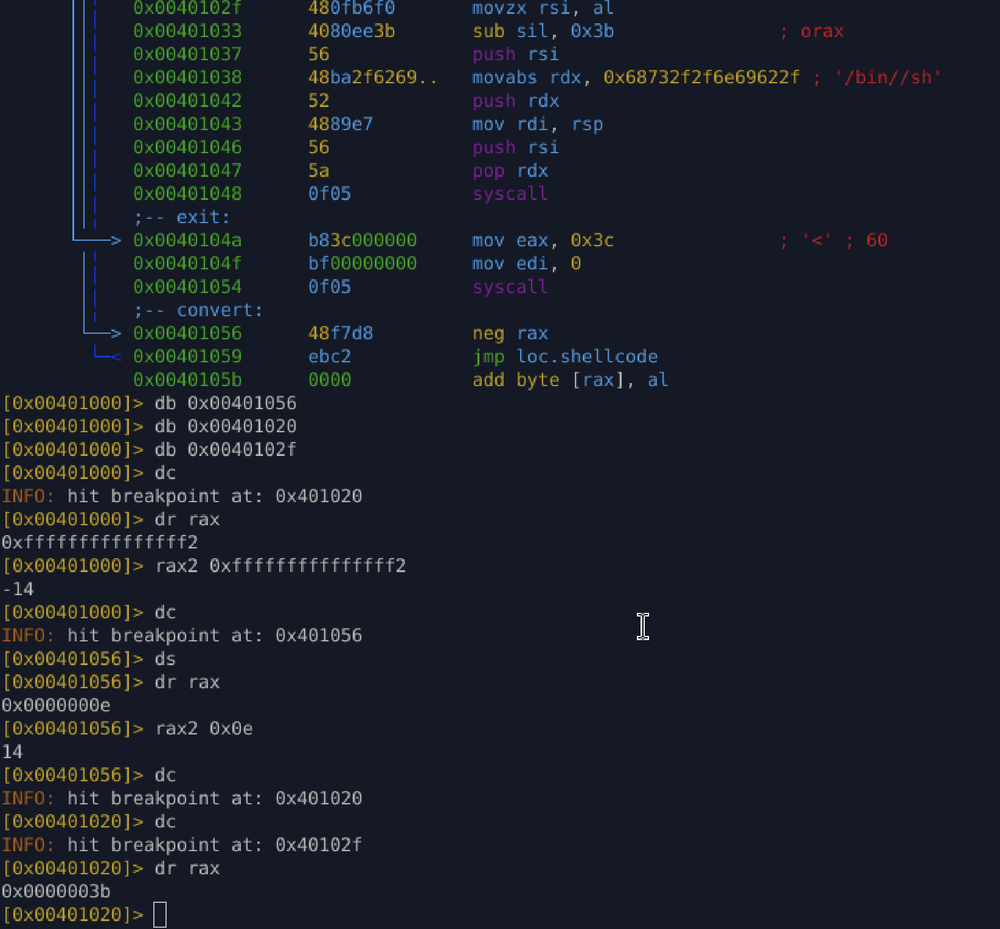
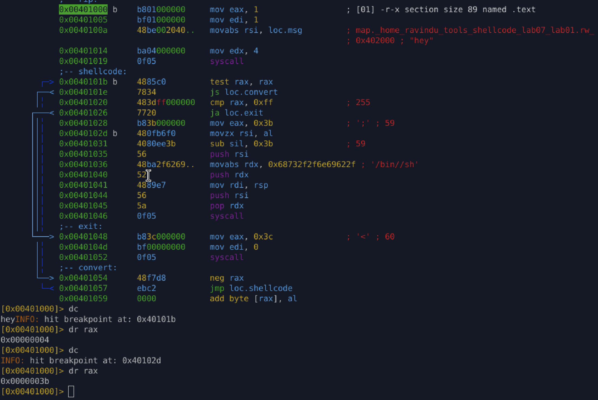

# Lab 07.1 — No `cdq`, No Known Zero

* Initial state assumes **no zeroed registers**
* Zero is **not created explicitly** (`xor`, `cdq` avoided)
* `write` syscall is used to **overwrite `rax` naturally**
* On success, `rax` returns a **small positive value**
* `cmp rax, 255` proves **upper bits are already zero**
* `mov eax, 59` relies on **implicit zero-extension**
* Zero originates from **syscall behavior + architectural rules**
* Failure path handled by checking negative `rax`

**Key point:**
Zero is *observed and reused*, not constructed.

## validation

1. failure syscall result

2. success syscall result

