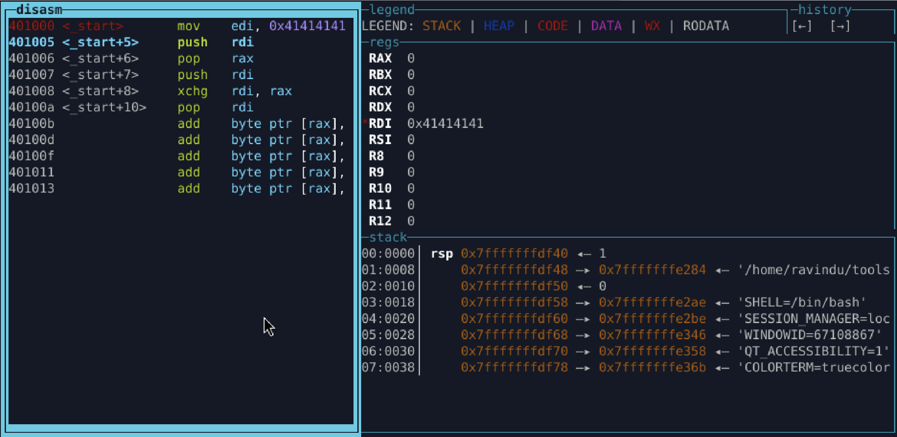
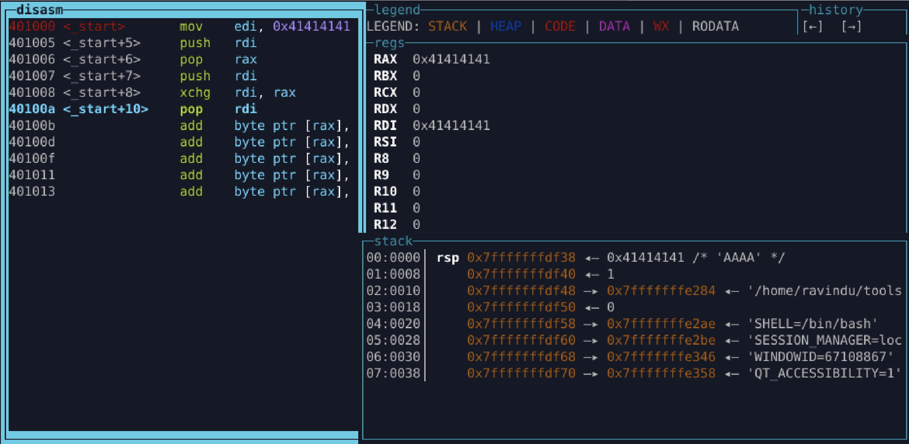

# Lab 07.2 — One Controlled Register Only

## Constraint
- You control exactly one register
- All other registers = garbage
- Stack is writable
- No assumptions about zero

## Note

- One register (rdi) is attacker-controlled at entry.
- Stack operations (push/pop, xchg) are used to propagate control to another register without assuming any initial state.
- Control expansion is achieved without injecting constants.
- At least one additional register is brought under attacker control.

## Verification

1. before 

2. After 

