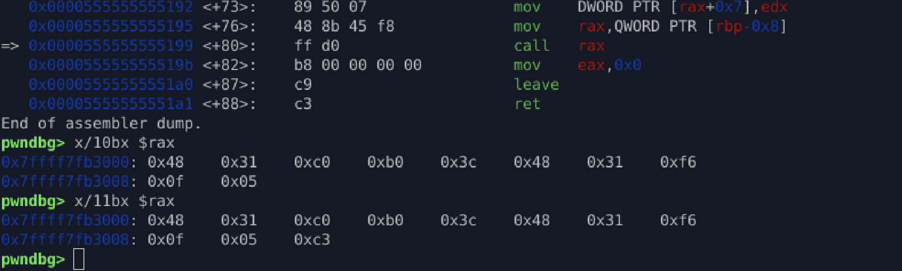
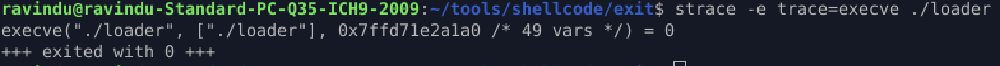

# **Exit Shellcode (x86_64 Linux)**

A minimal 64-bit Linux shellcode that invokes the `exit()` syscall using a null-free, position-independent payload.

---

## **Overview**

This shellcode cleanly terminates the process by calling:

* **Syscall:** `exit(0)`
* **rax = 60** (sys_exit)
* **rdi = 0**  (exit status)

Designed for exploit payloads that require:

* No NULL bytes
* Small instruction footprint
* Position-independent execution
* SysV ABI compliance

---

## **Shellcode Length**

* **10 bytes** (without `ret`)
* **11 bytes** (with optional `ret` for alignment)

---

## **Raw Bytes**

```
48 31 C0 B0 3C 48 31 F6 0F 05
```

---

## **Instruction Breakdown**

| Bytes    | Instruction  | Meaning                             |
| -------- | ------------ | ----------------------------------- |
| 48 31 C0 | xor rax, rax | clear `rax`                         |
| B0 3C    | mov al, 0x3c | load syscall number (60 = exit)     |
| 48 31 F6 | xor rdi, rdi | clear `rdi` (exit code) |
| 0F 05    | syscall      | trigger system call                 |

---

## **Build Instructions**

```
make build
```

This assembles the shellcode using `nasm` and creates the loader binary.

---

## **Run**

```
./loader
```

The loader maps and executes the shellcode directly.

---

## **Testing Environment**

* **OS:** Ubuntu 22.04 LTS (x86_64)
* **Kernel:** 5.x
* **Assembler:** NASM 2.16+
* **Tools:** `objdump`, `readelf`, `pwndbg`, `strace`

---

## **Disassembly**

```
objdump -M intel -d exit.o
```


---

## **GDB Verification (pwndbg)**

```
pwndbg> break <before call shellcode>
pwndbg> run
pwndbg> x/10i $rax
pwndbg> x/11i $rax
pwndbg> si
pwndbg> x/10i $rip
```




Useful for verifying instruction alignment and PIC behaviour.

---

## **Extract Raw Bytes**

To produce the final binary shellcode:

```
objcopy -O binary --only-section=.text exit exit.bin
hexdump -C exit.bin
```

---

## **strace Verification**

```
strace ./loader
```

Expected output:



Confirms proper syscall invocation.

---

## **Embedding Example (C)**

```c
#include <sys/mman.h>
#include <string.h>
#include <stdio.h>

unsigned char code[] = {
  0x48,0x31,0xc0, 0xb0,0x3c, 0x48,0x31,0xf6, 0x0f,0x05, 0xc3
};

int main(void) {
    void *mem = mmap(NULL, sizeof(code),
                     PROT_READ|PROT_WRITE|PROT_EXEC,
                     MAP_PRIVATE|MAP_ANONYMOUS, -1, 0);
    memcpy(mem, code, sizeof(code));
    ((void(*)())mem)();
    return 0;
}
```

---

## **Features**

* Null-free
* Position-Independent (PIC)
* Minimal footprint
* Clean syscall usage
* Reproducible build pipeline

---